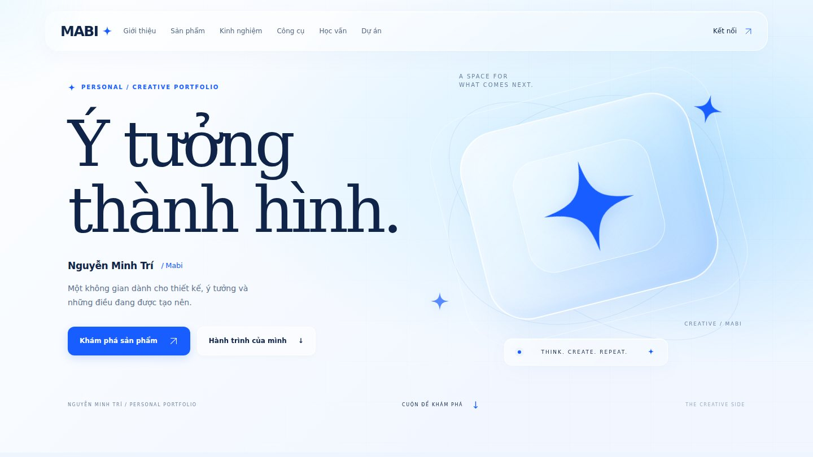

# Nguyễn Minh Trí — Mabi Portfolio

Portfolio xanh–trắng với chất kính lỏng, tinh tú 4 cánh theo chuột, gallery linh hoạt và editor dành cho chủ sở hữu. Nội dung học vấn, kinh nghiệm và tác phẩm khởi tạo để trống.

**Bắt đầu sử dụng:** [Hướng dẫn tiếng Việt](docs/HUONG_DAN.md).



Trang công khai chỉ đọc phiên bản xuất bản. Editor tại `#/editor` đăng nhập bằng Supabase Auth, kiểm tra quyền tại cơ sở dữ liệu và quản lý bản nháp riêng. Có thể tải bản HTML độc lập, chỉ để xem, kèm các ảnh/video đã xuất bản.

## Chạy trên máy

Yêu cầu Node.js 22 trở lên.

```sh
npm ci
npm run dev
```

Mở `http://localhost:4173`. Chạy lại lệnh dev sau khi sửa mã nguồn; đây là máy chủ xem thử, không có hot reload.

```sh
npm run check
```

Kiểm tra dữ liệu, quyền PostgreSQL/RLS và biên dịch vào `dist/`. Bộ kiểm tra RLS chạy trên PostgreSQL nhúng PGlite, có mô phỏng schema Auth/Storage; kết nối đăng nhập và tải tệp thực tế cần dự án Supabase riêng.

## Triển khai

Chọn **Settings → Pages → Source → GitHub Actions**, rồi chạy workflow **Deploy portfolio to Pages**. Các lần cập nhật `main` sau đó tự triển khai. Workflow kiểm tra dữ liệu và quyền trước khi build.

Các đường dẫn tài nguyên tương đối và router dùng hash, hỗ trợ đường dẫn repo của GitHub Pages mà không cần máy chủ chuyển tiếp route.

## Dữ liệu và quyền

`supabase/migrations/001_portfolio.sql` tạo bảng bản nháp, phiên bản xuất bản, metadata tệp và bảng chủ sở hữu riêng. Anonymous chỉ được đọc bảng xuất bản. Người đăng nhập chưa được cấp quyền chủ sở hữu không đọc được bản nháp, không tải tệp riêng và không thay đổi nội dung. Bản nháp và xuất bản đi qua RPC kiểm tra phiên bản để tránh ghi đè từ hai tab.

Bucket `portfolio-drafts` riêng tư; bucket `portfolio-public` chỉ chứa các tệp được chuẩn bị để xuất bản. Thay ảnh tạo đường dẫn mới để không đổi ảnh trong phiên bản công khai đang dùng. Xoá tệp bị chặn khi metadata còn được dùng trong nội dung.

`portfolio-config.json` chỉ chứa Project URL và publishable/anon key. Không đưa secret key, mật khẩu, service_role key hoặc phiên đăng nhập vào repo. Phiên chủ sở hữu được SDK lưu trong `sessionStorage` của tab và được tự làm mới; đăng xuất xoá phiên.

Các nội dung văn bản được escape trước khi hiển thị; link và giá trị kiểu giao diện được kiểm tra. SVG không được nhận làm ảnh upload.

Đã kiểm tra 11 tình huống dữ liệu/quyền và 9 luồng trên Chromium: public desktop/mobile, thiết lập, đăng nhập, tách bản nháp, tải ảnh, kéo kích thước, preview/xuất bản, HTML offline và đăng xuất. API Supabase được mô phỏng trong kiểm tra trình duyệt; đăng nhập và tải tệp trên dịch vụ thật cần hoàn thành thiết lập dự án của Bi.

## Kiến trúc

Giao diện dùng ES modules, CSS và Supabase JS SDK, được esbuild đóng gói. Không có CDN bắt buộc, backend riêng hoặc dữ liệu giả. `src/model.js` quản lý cấu trúc nội dung, `src/view.js` dùng chung renderer cho public và preview, `src/editor.js` quản lý chỉnh sửa, `src/backend.js` kết nối Supabase và `src/export.js` tạo HTML chỉ để xem.

## Tài liệu nền tảng

[Supabase Row Level Security](https://supabase.com/docs/guides/database/postgres/row-level-security), [Supabase Storage access control](https://supabase.com/docs/guides/storage/security/access-control), [GitHub Pages custom workflows](https://docs.github.com/en/pages/getting-started-with-github-pages/using-custom-workflows-with-github-pages).
